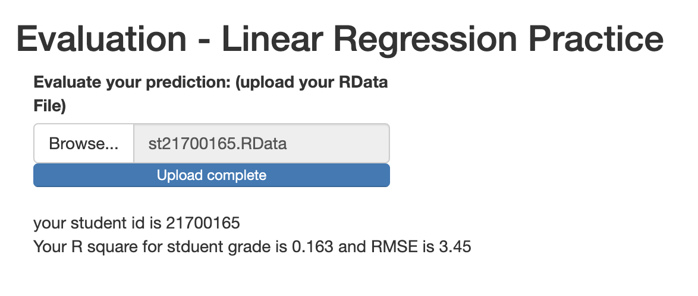
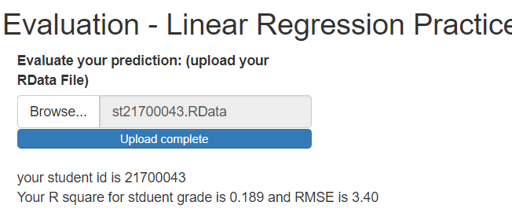
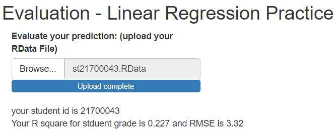
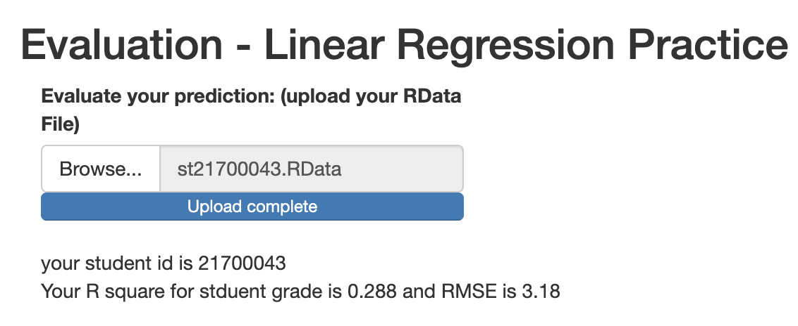
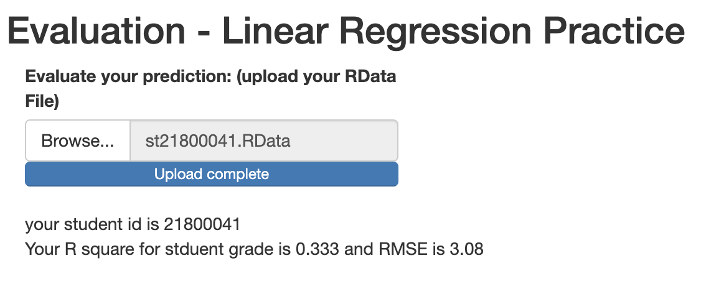

```{r}
load('data/regression_student.Rdata')
library(lubridate)
library(ggplot2)

dim(student.train)
dim(student.test.nolabel)


summary(student.train)

student.train$Medu <- as.factor(student.train$Medu)
student.train$Fedu <- as.factor(student.train$Fedu)
student.train$traveltime <- as.factor(student.train$traveltime)
student.train$failures <- as.factor(student.train$failures)
student.train$studytime <- as.factor(student.train$studytime)
student.train$famrel <- as.factor(student.train$famrel)
student.train$freetime <- as.factor(student.train$freetime)
student.train$goout <- as.factor(student.train$goout)
student.train$Dalc <- as.factor(student.train$Dalc)
student.train$Walc <- as.factor(student.train$Walc)
student.train$health <- as.factor(student.train$health)
str(student.train)

student.test.nolabel$Medu <- as.factor(student.test.nolabel$Medu)
student.test.nolabel$Fedu <- as.factor(student.test.nolabel$Fedu)
student.test.nolabel$traveltime <- as.factor(student.test.nolabel$traveltime)
student.test.nolabel$failures <- as.factor(student.test.nolabel$failures)
student.test.nolabel$studytime <- as.factor(student.test.nolabel$studytime)
student.test.nolabel$famrel <- as.factor(student.test.nolabel$famrel)
student.test.nolabel$freetime <- as.factor(student.test.nolabel$freetime)
student.test.nolabel$goout <- as.factor(student.test.nolabel$goout)
student.test.nolabel$Dalc <- as.factor(student.test.nolabel$Dalc)
student.test.nolabel$Walc <- as.factor(student.test.nolabel$Walc)
student.test.nolabel$health <- as.factor(student.test.nolabel$health)
str(student.test.nolabel)
```


#### Q1. 학생의 최종 성적을 예측하는 선형 회귀 모델을 만들어라. (주어진 모든 변수를 사용). 모델을 만드는 과정을 
설명하고, 필요하다면 전처리도 수행하고 전처리 과정도 설명하여라. 

- #### **code**\

```{r}
##for train data
hist(student.train$G3)
colSums(is.na(student.train))

fmla <- student.train$G3 ~ .
student_model <- lm(fmla, data= student.train)


```

- #### **Solution** \
Student.train과 Student.Test는 각 학생의 여러가지 교육 및 가정환경 변수로 구성되어 있다. 이번 과제는 G3(성적)을 알아내는 것으로 train에는 모든 변수값이 있으나 test값에는 G3 값이 없다.
lm 함수로 test G3값을 구하기 위해 train의 모든 변수로 G3를 예측하는 값을 먼저 찾아 grade_model로 설정한다. \
train 데이터 중 integer type으로 구성되어 있는 변수 중 factor type으로 변환 가능한 항목을 변환하였다. Medu, Fedu, traveltime, failures, studytime, famrel, freetime, goout, Dalc, Walc, health 변수는 integer type으로 있어도 값이 정해진 scale로 구성되었기 때문에 모두 factor type으로 변환해주었다.
이후 train의 prediction 값을 찾아주고 해당값을 vector로 뽑아내어 RData 파일로 저장 후 http://jict.handong.edu:3838/regression_practice/ 사이트에 올려 test 예측값을 확인하였다.\
\

#### Q2.1번 문제에서 학습한 모델의 RMSE와 R2를 측정하시오.
test 데이터에 대한 성능은 아래와 같이 사이트의 캡처를 첨부하시오. \


```{r}
calcRMSE <- function(label, estimation){
  return(sqrt(mean((label - estimation)**2)))
}

calcR2 <- function(label, estimation){
  RSS <- sum((label-estimation)**2)
  SStot <- sum((label-mean(label))**2)
  
  return(1-RSS/SStot)
}


student.train$pred <- predict(student_model, newdata = student.train)
student.test.nolabel$pred_grade_test<- predict(student_model, newdata = student.test.nolabel)
is.numeric(student.test.nolabel$pred_grade_test)
calcRMSE(student.train$G3, student.train$pred)

calcR2(student.train$G3, student.train$pred)
# student.test.nolabel$pred_grade_test
pred_grade_test<-student.test.nolabel$pred_grade_test
save(pred_grade_test, file ="st21700165.RData")
```

- #### **Solution** \
Training과 Test의 RMSE와 R2값은 아래와 같다.\

\


#### Q3. 1번 문제에서 얻은 선형 회귀모델을 해석해보시오.\
최종성적에 긍정적인 영향을 주는 변수와 부정적인 변수를 주는 변수는 무엇인가요?\	
모든 변수의 영향력을 다 설명할 필요는 없고, 모델에서 성적에 상당한 영향을 끼친다고 생각되는 변수만 설명 하면 됩니다. \
\

- #### **code**\

```{r}
summary(student_model)
colnames(student.train)

ggplot(student.train, aes(x=pred, y = G3)) +
  geom_point(alpha = 0.2, col = 'black') +
  geom_smooth() +
  geom_line(aes(x = G3, y= G3), col = 'blue', linetype = 2)

```

- #### **Solution** \
예측값과 학생 성적의 값이 상향하는 것으로 보이지만 G3를 1값 단위로 Predict값이 나열되어 있는 것을 볼 수 있다. 분포그래프가 줄처럼 나오는 것이 변수 또는 factor에 따라 predict값이 설정되어 시스템적 오류가 있는 것으로 확인된다.\
Regression은 파란 점선으로 표시 되어 있으며 상관관계의 통계값을 나타낸다. 파란 점선이 x,y비례 올라가기 때문에 예측값이 높아질 수록 학생 성적이 올라가는 관계를 나타낸다. 파란선을 중심으로 나온 회색 범위는 신뢰구간으로 Regression에 맞게 나온 값이 95% 신뢰수준이고 35%~45%가 신뢰구간이다. \
Regression선에서 크게 벗어나지 않는 scatter plot 값도 있지만 G3의 값에 따라 나열되어 있어 개별 에러 값이 크다. \
Linear Regression에서 y값을 Prediction-G3로 설정해보면 (predict,G3) scatter plot를 대각선으로 돌린 값처럼 나온다. 여기서도 똑같이 사선형식으로 scatter plot가 나열되어 있다. 두가지 형식 모두 그래프가 사선, 또는 줄로 값이 나와서 균등하지 않은 것으로 볼 수 있기 때문에 균등한 분포그래프를 만들기 위해서 사용되는 변수값을 수정해 작업해야 된다. \
최종성적에 영향을 주는 변수를 찾기 위해서는 P-value값이 0.05이하 또는 console에서 *표시가 된 항목을 1차로 참고하면 된다. 이중 Estimate값이 양수일 경우 해당 변수가 성적에 긍정적인 영향을, 음수일 경우 부정적인 영향을 끼치는 것으로 볼 수 있다.\ 
긍정적인 영향을 확실하게 미치는 것은 higher education을 목표한다에 해당 할 경우, 듣는 수업이 Portugal 수업일 경우, 가족구성원 수가 3명이하일때, 공부시간 등이다. 그 외에 0.05확률의 p value는 안 나왔지만 긍정적인 효과가 있는 것으로 확인할 수 있는 변수는 부모(특히 엄마)의 교육 수준, 그리고 아빠의 직업이 교사일 경우와 엄마의 직업이 서비스 관련 직종일 경우이다.\
부정적인 영향을 미치는 변수는 수업 failure, 수업관련보충(schoolsub)을 할 경우, 연애를 할 경우, 놀러다니는 경우, 건강, Mousinho da Silveira학교를 다니는 경우 등이다. \
유의해야할 점은 우연으로 나온 값이 상관관계가 있는 것으로 보일 수 있다. 예를 들어 포루투칼 수업을 들을 경우 성적이 오른다고 하지만 수학과 비교했을때 수업이 더 쉬워서 또는 성적을 더 쉽게 받는 구조 등이라서 일수 있다. 그외에 생각하지 못한 여러 상황을 염두하지 않았기 때문에 수학 대신 포르투갈 수업을 듣는다고 평균적으로 성적이 오른다고 판단할 수 없다. 마찬가지로 연애를 하거나 놀러다니는 경우 성적이 낮아진다고 하지만 놀러다니거나 연애를 해도 성적을 잘 받는 학생이 있을 수도 있기 때문에 확정 짓기는 확실한 상관관계를 가졌다고 보기 힘들다.\

\


#### Q4.

- #### **code**\

```{r}

## 1. 189
grade_model <- lm(G3 ~ school + famsize + studytime + failures + schoolsup + higher + romantic + goout + health + class, data = student.train)

```

- #### **Solution** \
- R^2: 0.189, RMSE:3.40\
test_data에서 R^2가 0.189가 되게 하는 입력변수들은 summary(grade_model)을 사용했을 때 P-value의 값이 0.05보다 작은 변수들로만 구성되게 했다. train_data는 G3를 변수로 가지고 있기에 calcRMSE, calcR2 함수를 사용할 수 있다. 해당 함수들을 사용한 결과  train_data의 RMSE는  3.2794, R^2는 0.2829843가 나오는 것을 확인할 수 있다. test_data의 RMSE와 R^2 값은 아래 사진과 같이 3.40, 0.189가 나오는 것을 확인할 수 있다.\


```{r}
## 2. 227
grade_model <- lm(G3 ~ school * class + studytime + failures + schoolsup + higher + romantic + goout + health + Mjob + Fjob, data = student.train)


```

- #### **Solution** \
- R^2: 0.227, RMSE:3.32\
test_data에서 R^2가 0.227가 되게 하는 입력변수들은 summary(grade_model)을 사용했을 때 P-value의 값이 0.05보다 작은 변수들로만 구성되게 하지 않고 Mjob과 Fjob을 추가로 입력변수로 넣어주고 school 변수와 class 변수를 곱해서 하나의 입력변수로 할당했다. Mjob과 Fjob은 P-value가 0.05와 0.1 사이인 값이긴 하지만, summary를 했을 때 Estimate에서 +에 해당하는 값이고, 일반적으로 생각해봤을 때에도 부모의 직업에 따라 충분히 자녀에게 학업적으로 도움을 줄 수 있다고 생각했기에 입력변수로 넣었다. school과 class 변수를 곱해서 하나의 입력변수로 할당한 이유는 성적이 학교에 따라, 어느 과목이냐에 따라 크게 달라질 수 있다고 생각했기에 두 변수가 연관성이 크다고 생각해서 곱해줬다. 이 모델의  train_data의 RMSE는  3.240082, R^2는 0.3000744가 나오는 것을 확인할 수 있다. test_data의 RMSE와 R^2 값은 아래 사진과 같이 3.32, 0.227이 나오는 것을 확인할 수 있다.

\


```{r}
## 3. 288

grade_model <- lm(G3 ~ age + school * class +school*reason+studytime*failures +internet*address+schoolsup + failures*higher + romantic + goout+Dalc+Walc + health+ guardian+Mjob*Fjob+Pstatus, data = student.train)


```




- #### **Solution** \
- R^2: 0.288, RMSE:3.18\
test_data에서 R^2가 0.288가 되게 하는 입력변수들은 summary(grade_model)을 사용했을 때 P-value의 값이 0.05보다 작은 변수들과 상관관계가 있을 것으로 보이는 변수를 함께 곱한 형식을 포함하였다. 학교*수업, 학교*학교 고른 이유, 공부시간*수업실패수, 인터넷*주소, 수업실패수*더교육받고싶은 생각, 그리고 부모님의 직장을 각각 곱해 상관관계가 있는 변수로 만들어주었다. 이러한 변수로 계산했을 때  test_data의 RMSE와 R^2 값은 아래 사진과 같이 3.18, 0.288가 나오는 것을 확인할 수 있다.\


\

```{r}
## 4.  322
grade_model <-
  lm(
    G3 ~ age + sex * address + school * class + school * reason + studytime *
      failures + internet * address  + failures * higher + sex * romantic +
      sex * class + reason * sex + sex * schoolsup + activities * goout + class *
      higher + Dalc + Walc + health + Mjob * Fjob+ Mjob*famsup+ Pstatus,
    data = student.train
  )

student.train$pred <- predict(grade_model, newdata = student.train)
student.test.nolabel$pred_grade_test<- predict(grade_model, newdata = student.test.nolabel)
is.numeric(student.test.nolabel$pred_grade_test)
calcRMSE(student.train$G3, student.train$pred)

calcR2(student.train$G3, student.train$pred)
# student.test.nolabel$pred_grade_test
pred_grade_test<-student.test.nolabel$pred_grade_test
save(pred_grade_test, file ="st21700165.RData")

```



\
#### Q5.

- #### **code**\

```{r}

student.train$pred <- predict(grade_model, newdata = student.train)
student.test.nolabel$pred_grade_test<- predict(grade_model, newdata = student.test.nolabel)
is.numeric(student.test.nolabel$pred_grade_test)
calcRMSE(student.train$G3, student.train$pred)

calcR2(student.train$G3, student.train$pred)
# student.test.nolabel$pred_grade_test
pred_grade_test<-student.test.nolabel$pred_grade_test
save(pred_grade_test, file ="st21700165.RData")
```

- #### **Solution** \
Your R square for stduent grade is 0.333 and RMSE is 3.08\

4번에서 실행한 model들 중 마지막 model을 best 모델로 선정하였다.
우리가 선택한 best 모델은 여러가지 변수의 결합을 생각해봤을 때, 다음과 같다.\ 
우리가 best 모델에서 중요하게 생각한 변수들은, 나이, 성별, 거주지, 수업 과목, 학교, 학교를 선택한 이유, 공부 시간, 실패한 과목들의 수(일명:재이수),가정에서의 인터넷 연결, 방과후 수업, 더 높은 교육을 위한 열정, 이성 관계 여부, 추가적인 활동, 친구들과의 외출, 음주 여부, 건강, 부모님의 직업, 부모님과의 동거상태이다.\

가장 먼저 수업을 수강한 학생들이 한 두명이 아니기 때문에, 각 학생들의 나이와 성별은 중요하다고 생각했다. 그래서 기본적으로 입력변수에 나이를 두었고, sex*address 을 한 이유는 성별에 따라서 거주지와 학교의 거리가 달라질 수 있다고 생각했다. 아들의 경우 딸에 비해서는 좀 더 거리가 멀어도 대중교통이나 걸어서 이동하는 것이 조금은 더 가능성이 높다고 판단하여 성별과 거주지 위치를 연결 지었다. 다음으로 school * class 을 연결 지은 이유는 학교 각 학교마다 수업의 난이도나 수업의 만족도 등이 달라질 수 있기 때문에, 학교와 수업을 연결지었다. 다음으로, school*reason 을 결합한 이유는, reason의 의미가 학교를 선택한 이유이기 때문에 당연히 학교가 한 개가 아닌 여러개이므로 각 학교마다 선택한 이유가 있을 것이라 판단하여 결합하였다. studytime*failures 을 결합한 이유는, 일반적인 Studytime만 있어도 어느 정도의 높은 결과를 나타내지만, 학업에 있어서 실패한 횟수가 높을 수록 그 과목에 대해서 더 열심히 공부하기 때문에 이를 결합했을 때, 예상과 적중하여 더 높은 결과물을 도출했기 때문이다. 다음으로, internet*address을 결합한 이유는 당연히 도시와 시골을 비교했을 때, 인터넷 연결면에서 차이가 날 수 있기 때문에 인터넷 연결과 거주지를 결합하였다. Schoolsup 을 입력 변수로 넣은 이유는 기본적인 학교 교육보다는 방과후를 통해 부족한 부분을 채울 수 있기 때문에, 입력 변수로 넣었다. failures*higher을 한 이유는, 실패한 재이수가 많을 수록 학업에 대한 열정이 더욱 높아지기 때문에, 이부분도 함께 결합하였다. sex*romantic 을 연결 지은 이유는 남,여 에 따라 이성 친구 및 교제 여부가 다르기 때문에 이 부분도 예측하여 입력변수로 넣었더니, 결과 값이 높게 도출되었다. sex*class 를 결합한 이유는 , 성별에 따라 수학과 포르투칼어의 학업 태도 및 학업 만족도가 달라지기 때문에 다음과 같이 결합하였다. reason*sex 을 결합 한 이유는 학교에 대한 자세한 정보가 없긴 하나, 성별에 따라서 학교를 선택하는 이유가 달라질 수있다. 예를 들어 여학생의 경우, 학교를 선택할 때, 여대를 선택할 수 도 있기 때문에, 이를 고려하여 결합하였다. sex*schoolsup 을 결합한 이유는 성별에 따라서 방과후 수업 참여 여부가 달라진다. 남학생의 경우 방과후 보다는 친구들과의 추억을 위해 더 노는 경우도 있기 때문에 이를 고려하였다. activities*goout를 결합한 이유는 추가적인 여가활동을 친구들과 함께 보내는지 아니면 홀로 보내는지 에 따라 결과가 달라질 수 있다고 판단하였다. 혼자 노는 경우, 100%확신은 못하지만, 대부분 함께 놀때 보다 더 절제할 수 있는 능력이 높아진다. 내가 그만 놀려고 해도 친구들이 더 놀자고 했을 때, 이를 거절하기 힘들기 때문이다.\
class*higher 을 결합한 이유는 수업 과목에 따라 학생들의 학업 열정이 달라지기 때문이다. 수학과 포르투칼어가 현재 수업 과목인데, 수학을 좋아하는 친구들도 있고, 포르트칼어를 좋아하는 친구들도 있고, 둘다 좋아하거나 둘다 싫어하는 학생들도 있기 때문에 이를 고려하여 결합하였더니 좋은 결과가 나왔다. Dalc+ Walc + health 을 넣은 이유는 학생들의 음주 여부에 따라서 학생들의 학업에 영향이 올 수 있기 때문에, 이를 고려하여 성적에도 영향을 미칠거라 판단하였다. Health 는 공부가 아니어도 모든 상황에서 중요한 사안이다. 건강하지않으면 공부도 할 수 없다. 따라서 health의 여부에 따라, 성적에도 영향을 미칠 수 있을 거라 판단하였다. \
Mjob*Fjob 을 결합한 이유는 부모의 존재여부도 학생에게 미치는 영향이 크겠지만, 현실적으로 부모님의 직업에 따라서도 자녀에 대한 교육 및 경제적 지원이 달라질 수 있다. 따라서 이를 고려하여 부모의 직업을 입력변수로 넣어 결과를 도출하였다. 안타까운 이야기지만, 가난한 학생들 보다는 경제적으로 부유한 학생들이 교육적인 면에서 더 많은 혜택을 누리는 것은 피할 수 없는 사실이다. 따라서 이를 생각해봤을 때, 성적에 영향을 미칠 거라 판단하였다. 개인적으로, 부모의 직업에 따라 Paid,famsup의 비율도 자동적으로 올라갈 것이라 생각하였다. 따라서 부모의 직업과 연결지어서 Mjob*famsup을 입력변수로 넣었더니, 결과가 월등히 상승하였다. 마지막으로 
Pstatus를 입력변수로 넣은 이유는 부모의 동거 상태 여부에 따라 학생에게 영향을 미칠 수 있을 것이라 판단하였다. 부모가 함께 있고, 없고에 따라 자녀들을 케어 할 수 있기 때문에, 이는 학생들의 건강 및 성적과도 연결지을 수 있다. \

따라서 위와 같은 이유에 따라 입력 변수들을 설정하였고, 결과적으로 R square for stduent grade is 0.333 / RMSE is 3.08 이라는 좋은 결과물을 도출하였다.\
\