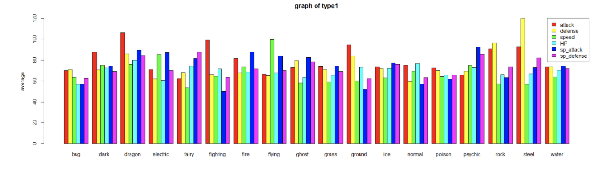

#### Q1. R 작업 환경에 데이터를 불러온 후 데이터에 대한 기본적인 정보를 파악하고 기술하시오.

 - #### **code**

```{r, tidy=FALSE}
pokemon <- read.csv('~/Documents/University/semester5/Data Science/practice/data/pokemon_fix-1.csv')
## install.packages("dplyr")
library(dplyr)
## install.packages('ggplot2')
library(ggplot2)
## practice1
glimpse(pokemon)
```

 - #### **Solution** \
R 패키지 중 dplyr를 설치하여 glimpse 함수를 사용할 수 있도록 설정한다. \
glimpse는 str와 비슷하지만 row와 column 수를 확인 할수 있도록 하는 함수로 리스트에 대한 설명을 볼 수 있도록 한다. \

+ ##### **pokemon의 특징** \
    - abilities는 포켓몬이 가지는 고유한 능력이라고 할 수 있다.\
    - 특성( Abilities)은 3세대에서부터 추가된 포켓몬 각각의 고유한 능력을 뜻한다. 모든 포켓몬에게 최소한 1개의 특성이 주어져 있으며, 대부분 포켓몬      배틀에 영향을 주지만 배틀과는 아무 상관이 없는 특성도 몇 가지 존재한다.\
    - against_N을 나타내는 것은 해당 특성과의 전투 중 받는데미지 %라고 할 수 있다. 1이라면 상대 타입 공격에 100%의 데미지를 받고, 2라면 상대 타입       공격에 200%의 데미지를 받을 수 있다고 할 수 있다.
    - base_egg_steps은 포켓몬 알 부화에 필요한 단계수를 의미한다.
    - base_happiness는 포켓몬의 기본 행복도를 나타낸다.
    - base_total은 포켓몬의 기본 능력치를 나타낸다. 
    - capture_rate는 포켓몬 포획 확률을 나타낸다.
    - classfication은 포켓몬의 종류를 나타낸다.(불, 풀 등)
    - experience_growth는 필요 경험치의 양을 나타낸다.
    - percentage_male는 해당 포켓몬의 수컷 종의 비율을 나타낸다. (성이 없으면 NA)
    - pokedex_number는 generation 순서대로 포켓몬 백과사전에 등록된 포켓몬의 순서이다
    - type_1, 2는 포켓몬의 특성에 대해 말해준다.
    - generation은 1~7세대 중 해당 포켓몬의 generation을 나타낸다.
    - is_legendary는 해당 포켓몬이 레전드리 포켓몬인지를 나타낸다.
    - (attack, defense, speed, hp, sp_attack, sp_defense)는 포켓몬의 기본적인 능력치(스텟)라고 할 수 있다.\
    \

#### Q2. 포켓몬은 타입에 따라서 다른 성질을 가진다. 포켓몬의 타입(type1) 에 따른 능력치 (attack, defense, speed, hp, sp_attack, sp_defense)의 특징을 기술하고,가능하다면 적합한 plot을 사용하여 시각화 하여 보아라.

- #### **code**
```{r}
pokemon$type1 <- factor(pokemon$type1)
##levels(pokemon$type1)
##table(pokemon$type1)

type1.total <- aggregate(cbind(attack, defense, speed, hp, sp_attack, sp_defense) ~ type1, data=pokemon, FUN= mean)
barplot(cbind(type1.total$attack, type1.total$defense, type1.total$speed, type1.total$hp, type1.total$sp_attack, type1.total$sp_defense) ~ type1.total$type1, 
        beside=T, col=rainbow(6), xlab="type", ylab = "average", main="graph of type1",horiz=F, cex.main=1,cex.lab=1)
#axis(side=2, at=seq(0,120,20))
legend("topright", legend=c("attack", "defense", "speed", "HP", "sp_attack", "sp_defense"), fill=rainbow(6))

```

- 위의 결과에서는 barchart에 표시되지 않는 변수들이 있어 확인하기 어렵다. 다음은 barchart를 확대해서 모든 변수가 화면 상에 나타나는 그래프이다.

- #### **Solution** \
type1을 factor값으로 변환 후 level이 몇개 있는지 확인해보면 총 18개가 있음을 알 수 있다.
pokemon 리스트 중 필요한 특징명만 선택해 aggregate로 묶어 놓고. type1 기준으로 모든 특징의 평균값을 확인 할 수 있도록 barplot을 구상한다. Barplot에는 총 6개의 특징이 들어가므로 색갈도 6가지로 설정하고 범례는 오른쪽 상단에 표시하도록 한다.
아래와 같이 type에서 높은 평균값을 확인 할 수 있다.\

특징 | 높은 type 
------------- | ------------- 
attack | Dragon, fighting, gound
defense |Steel, rock, fighting
speed | Flying, electric
HP | Dragon (큰차이 없음)
sp_attack | Psychic, dragon, fire 등( 큰차이 없음)
sp_defense | Psychic, dragon, fairy 등 (큰 차이 없음)

```{r}
type1.total
```

type 별로 공력, 방어력, 스피트, HP, 특수공격, 특수 방어의 차이는 위와 같은 수치로 볼 수 있다.\ 

특징 | 높은 type 
------------- | ------------- 
attack | Dragon(106)
defense |Steel(120)
speed | Flying(99)
HP | Dragon (79), Normal(76)
sp_attack | Psychic (92), Dragon(89), Electric(87)
sp_defense | Fairy(87), Psychic(85), dragon(84)
\

#### Q3. 포켓몬은 다양한 키와 몸무게 수치를 가지고 있다.\
####  덩치카 큰 포켓몬이 방어력이 높다고 할 수 있는가? \  
####  덩치가 작은 포켓몬이 속도가 빠르다고 할 수 있는가? \
####  덩치가 큰 포켓몬과 작은 포켓몬을 그룹을 나누어 비교해보자. (능력적으로 차이점이 있는지) \
####  가능하다면 이 문제를 설명하기 위하여 적합한 plot으로 시각화 해보아라. \

- #### **code**

```{r}
plot(pokemon$weight_kg,pokemon$height_m)
plot(pokemon$weight_kg,pokemon$defense)
plot(pokemon$weight_kg,pokemon$speed)
plot(pokemon$height_m,pokemon$defense)
plot(pokemon$height_m,pokemon$speed)

size_byheight<-quantile(pokemon$height_m,na.rm=T)
size_divide<-cut(pokemon$height_m,breaks=size_byheight,include.lowest = T)
levels(size_divide)<-c('Very small ~0.6m','Small 1m','Big 1.5m','Very Big 14m')
table(size_divide)
plot(size_divide,pokemon$defense)
plot(size_divide,pokemon$speed)

```

- #### **Solution** \

plot결과로 보면 키 크기에 따라 defense가 높아지는 경향이 있다. speed의 경우 키 크기에 따라 작은 포켓몬(1m이하)보다는 큰 몬스터가 더 빠르다. 그러나 1.5m와 14m 정도의 포켓몬 스피트 차이를 크게 보이지 않는다. 덩치를 height와 weight 둘중 하나만 사용해도 괜찮을 것으로 보인다. (둘다 비슷한 plot 값을 보이기 때문에 그렇게 하고, 이중 height를 2개 그룹으로만 나누는 방법이 아직 확실하지 않아서 quantile 로 4가지로 나눴다.) \
모든 포켓몬 801마리 중 height값이 NA인 포켓몬을 제외한 781마리의 포켓몬을 미터 기준으로 나눠진다. \

**도현 's Solution**

- **code**
```{r}
##1
size_byheight<-quantile(pokemon$height_m,na.rm=T)
size_divide<-cut(pokemon$height_m,breaks=size_byheight,include.lowest = T)
levels(size_divide)<-c('Very small ~0.6m','Small 1m','Big 1.5m','Very Big 14m')
table(size_divide)
plot(size_divide,pokemon$speed)
##2
size_byweight<-quantile(pokemon$weight_kg,na.rm=T)
size_divide2<-cut(pokemon$weight_kg,breaks=size_byweight,include.lowest = T)
levels(size_divide2)<-c('Very light 9kg','light 27.3kg','heavy 64.8kg','Very heavy 999kg')
table(size_divide2)

```

- **Solution**

‘덩치가 크다’의 기준을 ‘키가 크다’와 ‘몸무게가 많이 나간다’로 정의해서 진행하였다.
키가 크면 -> defense가 높은가?는 데이터 plot을 통해 유의미한 결과를 낳는다.
boxplot을 보면 우상향 하는 것을 볼 수 있기에 키가 크면 defense가 높다고 할 수 있다.
키가 작으면 -> speed가 빠른가?는 데이터 plot을 통해 그렇지 않음을 알 수 있다.
boxplot을 보면 하위 25%의 very small 구간이 오히려 가장 느린 speed 평균치를 보여주고 
있음을 볼 수 있고, 상위 75%의 Big 구간이 가장 빠른 speed를 가짐을 알 수 있다. \


몸무게가 많이 나가면  -> defense가 높은가?는 데이터 plot을 통해 유의미한 결과를 낳는다.
boxplot을 보면 우상향 하는 것을 볼 수 있기에 몸무게가 많이 나가면 defense가 높다고 할 수 있다.
몸무게가 적게 나가면 -> speed가 빠른가?는 데이터 plot을 통해 그렇지 않음을 알 수 있다.
boxplot을 보면 하위 25%의 very light 구간이 오히려 가장 느린 speed 평균치를 보여주고 있음을 볼 수 있고, 상위 75%의 heavy 구간이 가장 빠른 speed 평균치를 가짐을 알 수 있다. 

종합적으로 보면 덩치가 큰 포켓몬은 defense가 높음을 알 수 있고, 덩치가 작은 포켓몬은 speed가 빠르지 않음을 알 수 있다.

```{r}
plot(size_divide2, pokemon$defense)
plot(size_divide,pokemon$speed)
```

#### Q4. 포켓몬은 다양한 키와 몸무게 수치를 가지고 있다. 덩치카 큰 포켓몬이 방어력이 높다고 할 수 있는가? 덩치가 작은 포켓몬이 속도가 빠르다고 할 수 있는가? 덩치가 큰 포켓몬과 작은 포켓몬을 그룹을 나누어 비교해보자. (능력적으로 차이점이 있는지) 가능하다면 이 문제를 설명하기 위하여 적합한 plot으로 시각화 해보아라.

 - #### **code**

```{r}
# generation.? <- aggregate(? ~ generation, data = pokemon, FUN = mean)의 형태는 세대 별로
# ?의 평균 수치를 나타낸 것이다.
```
```{r}
generation.attack <- aggregate(attack ~ generation, data = pokemon, FUN = mean)
generation.defense <-aggregate(defense ~ generation, data = pokemon, FUN = mean)
generation.speed <-aggregate(speed ~ generation, data = pokemon, FUN = mean)
generation.hp <-aggregate(hp ~ generation, data = pokemon, FUN = mean)
generation.sp_attack <-aggregate(sp_attack ~ generation, data = pokemon, FUN = mean)
generation.sp_defense <-aggregate(sp_defense ~ generation, data = pokemon, FUN = mean)
generation.is_legendary <-aggregate(is_legendary ~ generation, data = pokemon, FUN = mean)
generation.base_total <-aggregate(base_total ~ generation, data = pokemon, FUN = mean)
generation.experience_growth <-aggregate(experience_growth ~ generation, data = pokemon, FUN = mean)
generation.base_happiness <-aggregate(base_happiness ~ generation, data = pokemon, FUN = mean)
generation.base_egg_steps <-aggregate(base_egg_steps ~ generation, data = pokemon, FUN = mean)
generation.against_bug <-aggregate(against_bug ~ generation, data = pokemon, FUN = mean)
generation.against_dark <-aggregate(against_dark ~ generation, data = pokemon, FUN = mean)
generation.against_dragon <-aggregate(against_dragon ~ generation, data = pokemon, FUN = mean)
generation.against_electric <-aggregate(against_electric ~ generation, data = pokemon, FUN = mean)
generation.against_fairy <-aggregate(against_fairy ~ generation, data = pokemon, FUN = mean)
generation.against_fight <-aggregate(against_fight ~ generation, data = pokemon, FUN = mean)
generation.against_fire <-aggregate(against_fire ~ generation, data = pokemon, FUN = mean)
generation.against_flying <-aggregate(against_flying ~ generation, data = pokemon, FUN = mean)
generation.against_ghost <-aggregate(against_ghost ~ generation, data = pokemon, FUN = mean)
generation.against_grass <-aggregate(against_grass ~ generation, data = pokemon, FUN = mean)
generation.against_ground <-aggregate(against_ground ~ generation, data = pokemon, FUN = mean)
generation.against_ice <-aggregate(against_ice ~ generation, data = pokemon, FUN = mean)
generation.against_normal <-aggregate(against_normal ~ generation, data = pokemon, FUN = mean)
generation.against_poison <-aggregate(against_poison ~ generation, data = pokemon, FUN = mean)
generation.against_psychic <-aggregate(against_psychic ~ generation, data = pokemon, FUN = mean)
generation.against_rock <-aggregate(against_rock ~ generation, data = pokemon, FUN = mean)
generation.against_steel <-aggregate(against_steel ~ generation, data = pokemon, FUN = mean)
generation.against_water <-aggregate(against_water ~ generation, data = pokemon, FUN = mean) 
```

```{r}
# 각 세대 별로 ?의 평균 수치를 정리한 다음 generation.total이라는 데이터프레임에 모두 합쳐준다.
```
```{r}
generation.total <- merge(generation.attack, generation.defense)
generation.total <- merge(generation.total, generation.speed)
generation.total <- merge(generation.total, generation.hp)
generation.total <- merge(generation.total, generation.sp_attack)
generation.total <- merge(generation.total, generation.sp_defense)
generation.total <- merge(generation.total, generation.is_legendary)
generation.total <- merge(generation.total, generation.base_total)
generation.total <- merge(generation.total, generation.experience_growth)
generation.total <- merge(generation.total, generation.base_happiness)
generation.total <- merge(generation.total, generation.base_egg_steps)
generation.total <- merge(generation.total, generation.against_bug)
generation.total <- merge(generation.total, generation.against_dark)
generation.total <- merge(generation.total, generation.against_dragon)
generation.total <- merge(generation.total, generation.against_electric)
generation.total <- merge(generation.total, generation.against_fairy)
generation.total <- merge(generation.total, generation.against_fight)
generation.total <- merge(generation.total, generation.against_fire)
generation.total <- merge(generation.total, generation.against_flying)
generation.total <- merge(generation.total, generation.against_ghost)
generation.total <- merge(generation.total, generation.against_grass)
generation.total <- merge(generation.total, generation.against_ground)
generation.total <- merge(generation.total, generation.against_ice)
generation.total <- merge(generation.total, generation.against_normal)
generation.total <- merge(generation.total, generation.against_poison)
generation.total <- merge(generation.total, generation.against_rock)
generation.total <- merge(generation.total, generation.against_steel)
generation.total <- merge(generation.total, generation.against_water) 
```

```{r}
barplot(cbind(generation.total$attack) ~ generation.total$generation, beside=T, col=rainbow(7), xlab="generation", ylab = "attack average", main="graph of attack")
barplot(cbind(generation.total$defense) ~ generation.total$generation, beside=T, col=rainbow(7), xlab="generation", ylab = " defense average", main="graph of defense")
barplot(cbind(generation.total$speed) ~ generation.total$generation, beside=T, col=rainbow(7), xlab="generation", ylab = " defense average", main="graph of speed")
barplot(cbind(generation.total$hp) ~ generation.total$generation, beside=T, col=rainbow(7), xlab="generation", ylab = " defense average", main="graph of hp")
barplot(cbind(generation.total$sp_attack) ~ generation.total$generation, beside=T, col=rainbow(7), xlab="generation", ylab = " defense average", main="graph of sp_attack")
barplot(cbind(generation.total$sp_defense) ~ generation.total$generation, beside=T, col=rainbow(7), xlab="generation", ylab = " defense average", main="graph of sp_defense")
barplot(cbind(generation.total$is_legendary) ~ generation.total$generation, beside=T, col=rainbow(7), xlab="generation", ylab = "average", main="graph of is_legendary")
barplot(cbind(generation.total$base_total) ~ generation.total$generation, beside=T, col=rainbow(7), xlab="generation", ylab = "average", main="graph of base_total")
barplot(cbind(generation.total$experience_growth) ~ generation.total$generation, beside=T, col=rainbow(7), xlab="generation", ylab = "average", main="graph of experience_growth")
barplot(cbind(generation.total$base_happiness) ~ generation.total$generation, beside=T, col=rainbow(7), xlab="generation", ylab = "average", main="graph of base_happiness")
barplot(cbind(generation.total$base_egg_steps) ~ generation.total$generation, beside=T, col=rainbow(7), xlab="generation", ylab = "average", main="graph of base_egg_steps")
barplot(cbind(generation.total$against_bug) ~ generation.total$generation, beside=T, col=rainbow(7), xlab="generation", ylab = "average", main="graph of against_bug")
barplot(cbind(generation.total$against_dark) ~ generation.total$generation, beside=T, col=rainbow(7), xlab="generation", ylab = "average", main="graph of against_dark")
barplot(cbind(generation.total$against_dragon) ~ generation.total$generation, beside=T, col=rainbow(7), xlab="generation", ylab = "average", main="graph of against_dragon")
barplot(cbind(generation.total$against_electric) ~ generation.total$generation, beside=T, col=rainbow(7), xlab="generation", ylab = "average", main="graph of against_electric")
barplot(cbind(generation.total$against_fairy) ~ generation.total$generation, beside=T, col=rainbow(7), xlab="generation", ylab = "average", main="graph of against_fairy")
barplot(cbind(generation.total$against_fight) ~ generation.total$generation, beside=T, col=rainbow(7), xlab="generation", ylab = "average", main="graph of against_fight")
barplot(cbind(generation.total$against_fire) ~ generation.total$generation, beside=T, col=rainbow(7), xlab="generation", ylab = "average", main="graph of against_fire")
barplot(cbind(generation.total$against_flying) ~ generation.total$generation, beside=T, col=rainbow(7), xlab="generation", ylab = "average", main="graph of against_flying")
barplot(cbind(generation.total$against_ghost) ~ generation.total$generation, beside=T, col=rainbow(7), xlab="generation", ylab = "average", main="graph of against_ghost")
barplot(cbind(generation.total$against_grass) ~ generation.total$generation, beside=T, col=rainbow(7), xlab="generation", ylab = "average", main="graph of against_grass")
barplot(cbind(generation.total$against_ground) ~ generation.total$generation, beside=T, col=rainbow(7), xlab="generation", ylab = "average", main="graph of against_ground")
barplot(cbind(generation.total$against_ice) ~ generation.total$generation, beside=T, col=rainbow(7), xlab="generation", ylab = "average", main="graph of against_ice")
barplot(cbind(generation.total$against_normal) ~ generation.total$generation, beside=T, col=rainbow(7), xlab="generation", ylab = "average", main="graph of against_normal")
barplot(cbind(generation.total$against_poison) ~ generation.total$generation, beside=T, col=rainbow(7), xlab="generation", ylab = "average", main="graph of against_poison")
barplot(cbind(generation.total$against_rock) ~ generation.total$generation, beside=T, col=rainbow(7), xlab="generation", ylab = "average", main="graph of against_rock")
barplot(cbind(generation.total$against_steel) ~ generation.total$generation, beside=T, col=rainbow(7), xlab="generation", ylab = "average", main="graph of against_steel")
barplot(cbind(generation.total$against_water) ~ generation.total$generation, beside=T, col=rainbow(7), xlab="generation", ylab = "average", main="graph of against_water") 
```

 - #### **Solution** \
+ ##### **각 세대 별 pokemon의 특징** \
- attack은 7세대가 84.6으로 가장 높고 2세대가 69.9로 가장 낮음을 알 수 있다.
- defense는 7세대가 78로 가장 높고 1세대가 70으로 가장 낮음을 알 수 있다.
- speed는 1세대가 70.1로 가장 높고 2세대가 61.6으로 가장 낮음을 알 수 있다.
- hp는 4세대가 73.1로 가장 높고 1세대가 64.3으로 가장 낮음을 알 수 있다.
- sp_attack은 6세대가 76.5로 가장 높고 2세대가 65.4로 가장 낮음을 알 수 있다.
- sp_defense는 7세대가 75.6으로 가장 높고 5세대가 67.7로 가장 낮음을 알 수 있다.
- is_legendary는 7세대가 21% 비율로 가장 높고 1세대가 3%로 가장 낮음을 알 수 있다.
- base_total은 4세대가 451.1로 가장 높고 2세대가 413.1로 가장 낮음을 알 수 있다.
- experience_growth는 5세대가 1061557로 가장 높고 2세대가 1025866로 가장 낮음을 알 수 있다.
- base_happiness는 1세대가 69.7로 가장 높고 7세대가 56.8로 가장 낮음을 알 수 있다.
- base_egg_steps은 7세대가 9600으로 가장 높고 1세대가 5933.7로 가장 낮음을 알 수 있다.
- against_bug는 3세대가 1.14로 가장 높고 1세대가 0.91로 가장 낮음을 알 수 있다.
- against_dark는 3세대가 1.08로 가장 높고 2세대가 1.02로 가장 낮음을 알 수 있다.
- against_dragon은 5세대가 1.01로 가장 높고 7세대가 0.9로 가장 낮음을 알 수 있다.
- against_electric은 1세대가 1.15로 가장 높고 5세대가 1.01로 가장 낮음을 알 수 있다.
- against_fairy는 5세대가 1.16으로 가장 높고 1세대가 0.91로 가장 낮음을 알 수 있다.
- against_fight는 4세대가 1.16으로 가장 높고 7세대가 0.91로 가장 낮음을 알 수 있다.
- against_fire는 5세대가 1.23으로 가장 높고 1세대가 1.03으로 가장 낮음을 알 수 있다.
- against_flying은 7세대가 1.33으로 가장 높고 2세대가 1.13으로 가장 낮음을 알 수 있다.
- against_ghost는 6세대가 1.04로 가장 높고 2세대가 0.92로 가장 낮음을 알 수 있다.
- against_grass는 1세대가 1.14로 가장 높고 7세대가 0.89로 가장 낮음을 알 수 있다.
- against_ground는 1세대가 1.17로 가장 높고 2세대가 1.02로 가장 낮음을 알 수 있다.
- against_ice는 4세대가 1.26으로 가장 높고 1세대가 1.16으로 가장 낮음을 알 수 있다.
- against_normal은 1세대가 0.94로 가장 높고 6세대가 0.82로 가장 낮음을 알 수 있다.
- against_poison은 7세대가 1.13으로 가장 높고 1세대가 0.89로 가장 낮음을 알 수 있다.
- against_rock은 2세대가 1.37로 가장 높고 3세대가 1.17로 가장 낮음을 알 수 있다.
- against_steel은 6세대가 1.21로 가장 높고 1세대가 0.94로 가장 낮음을 알 수 있다.
- against_water는 2세대가 1.14로 가장 높고 7세대가 0.98로 가장 낮음을 알 수 있다.
    \


#### Q5. 당신이 피카츄와 대결해야한다고 가정해보자. 이때 능력치와 성질을 기반으로 피카츄와 대결하기에 유리한 10개의 포켓몬을 찾아보자. 왜 당신이 고른 포켓몬이 피카츄에 유리한지, 데이터셋을 통해 찾아낸 정보를 기반으로 설명하라.


 - #### **Solution** \
```{r}
pokemon[pokemon$name == 'Pikachu', ]

```

Pikachu의 능력치에 대한 설명은 아래와 같다.
against_ground: 상대 몬스터의 타입이 ground일 경우 피카츄가 받는 피해량이 다른 타입에 비해 더 높다 
피카츄의 기본적인 상태수치는 hp=35 height= 0.4 attack=55 defense=40 sp.attack=50, sp.defense=50 speed=90
따라서 ground-type에서 피카츄의 기본적인 상태수치보다 높은 포켓몬들을 선택하도록 하였다.


- #### **code**

```{r}
against_Pikachu<-pokemon[pokemon$type1=='ground',c('name','against_electric','hp','height_m','attack','defense','sp_attack','sp_defense')]
hp_overPika <- subset(against_Pikachu, hp > 35)
attack_overPika <- subset(against_Pikachu, attack > 55)
defense_overPika <- subset(against_Pikachu, defense > 40)
spattack_overPika <- subset(against_Pikachu, sp_attack > 50)
spdefense_overPika <- subset(against_Pikachu, sp_defense > 50)
z<-merge(hp_overPika,attack_overPika)
y<-merge(z,defense_overPika)
x<-merge(y,spattack_overPika)
VS_pika<-merge(x,spdefense_overPika)
VS_pika
sampleVS<-VS_pika[sample(1:11,10),]
sampleVS
```


#### Q6. 포켓몬 중에는 매우 희귀한 전설의 포켓몬 (legendary) 이 있다. 전설의 포켓몬과 일반 포켓몬의 가장 큰 차이점은 무엇인가. 어떤 특징을 통해서 포켓몬이 전설의 포켓몬인지 구분할 수 있을지 설명해보자.

- #### **code**
```{r}
head(pokemon[pokemon$is_legendary == 1, ], 5)

legend_height<-aggregate(height_m~is_legendary,data=pokemon,FUN=mean)
legend_weight<-aggregate(weight_kg~is_legendary,data=pokemon,FUN=mean)
legend_attack<-aggregate(attack~is_legendary,data=pokemon,FUN=mean)
legend_defense<-aggregate(defense~is_legendary,data=pokemon,FUN=mean)
legend_hp<-aggregate(hp~is_legendary,data=pokemon,FUN=mean)

l1<-merge(legend_attack,legend_defense)
l2<-merge(l1,legend_height)
l3<-merge(l2,legend_weight)
legendary_compare<-merge(l3,legend_hp)

table(pokemon$is_legendary)
table(pokemon$is_legendary,pokemon$type1)
legendary_compare
```

- #### **Solution** \
  + legendary pokemon은 801중 70마리로 기본적으로 몸무게 평균이 일반 pokemon보다 약 4~5배 많다. 
  + attack, defense, hp 도 일반 pokemon보다 20~30 point 더 많다. 
  + legendary pokemon은 fire, poison type에는 없고 유독 psychic type이 많다\
  
```{r}
type1.total <- aggregate(cbind(attack, defense, speed, hp, sp_attack, sp_defense) ~ type1, data=pokemon, FUN= mean)

barplot(cbind(type1.total$attack, type1.total$defense, type1.total$speed, type1.total$hp, type1.total$sp_attack, type1.total$sp_defense) ~ type1.total$type1, 
        beside=T, col=rainbow(6), xlab="type", ylab = "average", main="graph of type1",horiz=F)

#axis(side=2, at=seq(0,120,20))
legend("bottomright", legend=c("attack", "defense", "speed", "HP", "sp_attack", "sp_defense"), fill=rainbow(6))

```

